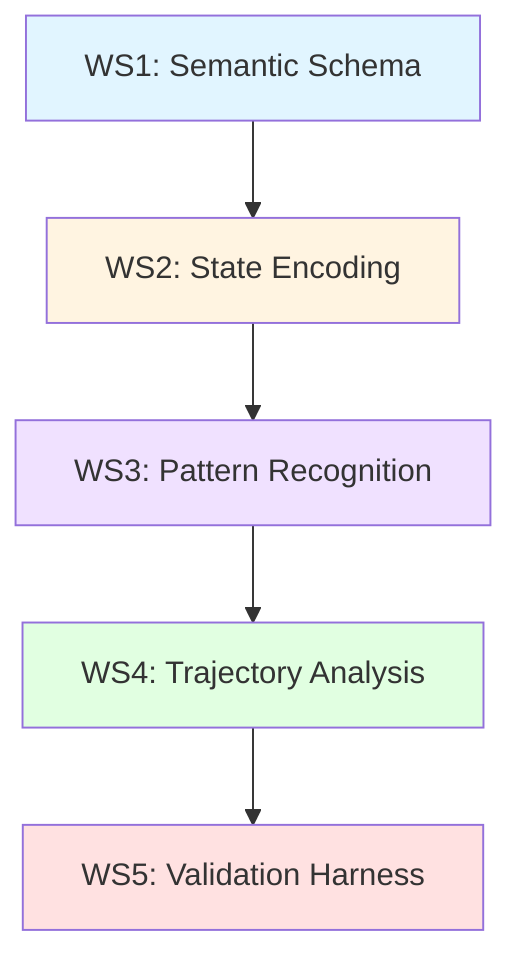

# Phase 4 Architecture Diagrams

## 1. ASCII High-Level Diagram

```
           [ WS1 ]
              |
           [ WS2 ]
              |
           [ WS3 ]
              |
           [ WS4 ]
              |
           [ WS5 ]
```

**Legend:**
- WS1: Semantic Schema
- WS2: State Encoding
- WS3: Pattern Recognition
- WS4: Trajectory Analysis
- WS5: Validation Harness

**Flow:** One-directional, top-to-bottom, no cycles.

---

## 2. Mermaid Architecture Diagram



**Characteristics:**
- Strict sequential flow
- No backward edges
- No parallel branches
- Each workstream consumes output from the previous workstream

---

## 3. Responsibility Matrix

| Workstream | Accepts | Outputs | Must Not Do | Constraints |
|------------|---------|---------|-------------|-------------|
| **WS1: Semantic Schema** | N/A | Dataclass definitions for all domain concepts (beliefs, desires, intentions, physiological state, social context, stressors, interventions) | Execute any computation; contain any logic | Purely definitional; frozen for Phase 5; defines types only |
| **WS2: State Encoding** | Semantic state objects (from WS1 schema) | Encoded state representation | Perform pattern recognition; classify trajectories; validate outputs | Transforms raw state into structured encodings; read-only on inputs; no scoring |
| **WS3: Pattern Recognition** | Encoded state (from WS2) | Detected patterns with qualitative evidence | Mutate WS2 outputs; perform trajectory analysis; assign numeric scores | Applies rule-based detection; generates symbolic evidence; no ML; no backward mutation |
| **WS4: Trajectory Analysis** | Patterns and state sequences (from WS3) | Trajectory classifications with qualitative labels | Mutate WS3 outputs; perform validation; introduce numeric confidence | Analyzes state evolution; classifies trajectories qualitatively; rule-based only |
| **WS5: Validation Harness** | Trajectory outputs (from WS4) | Validation reports (pass/fail + evidence) | Mutate WS4 outputs; execute domain logic; perform inference | Validates outputs against contracts; structural checks only; no computation |

---

## 4. Detailed Workstream Descriptions

### WS1: Semantic Schema

**Purpose:** Define the vocabulary and structure of the 3QP domain.

**Responsibilities:**
- Define dataclasses for all domain entities
- Establish type contracts
- Document field semantics

**Key Outputs:**
- `BaselineState`
- `BeliefState`, `DesireState`, `IntentionState`
- `PhysiologicalState`, `SocialContext`
- `Stressor`, `Intervention`

**No computation.**

---

### WS2: State Encoding

**Purpose:** Transform semantic state into encoded representations suitable for analysis.

**Responsibilities:**
- Implement encoders for each state component
- Apply transformation logic
- Generate structured encoded state

**Key Outputs:**
- `EncodedState` (aggregates all encoded components)
- `EncodedBeliefs`, `EncodedDesires`, `EncodedIntentions`
- `EncodedPhysiology`, `EncodedSocialContext`
- `EncodedStressors`, `EncodedInterventions`

**Constraints:**
- Read-only on inputs
- No pattern detection
- No scoring

---

### WS3: Pattern Recognition

**Purpose:** Detect qualitative patterns in encoded state.

**Responsibilities:**
- Implement rule-based recognizers
- Detect patterns using if-then logic
- Generate evidence structures with categorical labels

**Key Outputs:**
- `RecognizedPattern` (pattern ID + qualitative evidence)
- `PatternEvidence` (symbolic justification)

**Constraints:**
- No mutation of WS2 outputs
- No numeric scoring
- No ML-based detection
- All reasoning must be interpretable

---

### WS4: Trajectory Analysis

**Purpose:** Classify the evolution of state over time.

**Responsibilities:**
- Analyze state sequences
- Apply trajectory classification rules
- Generate qualitative trajectory labels

**Key Outputs:**
- `TrajectoryClassification` (label + qualitative metadata)
- `TrajectoryEvidence` (reasoning chain)

**Constraints:**
- No mutation of WS3 outputs
- No numeric confidence scores
- Rule-based classification only
- All labels must be qualitative (e.g., "escalating", "stabilizing")

---

### WS5: Validation Harness

**Purpose:** Validate that WS4 outputs conform to architectural contracts.

**Responsibilities:**
- Check structural integrity
- Validate required fields
- Ensure qualitative constraints are met
- Generate pass/fail reports

**Key Outputs:**
- `ValidationReport` (pass/fail + evidence)
- `ValidationEvidence` (specific violations or confirmations)

**Constraints:**
- No mutation of WS4 outputs
- No domain logic execution
- Structural validation only
- No computation

---

## 5. Data Flow Example

```
Baseline State (WS1 schema)
         ↓
      [WS2: Encode]
         ↓
   Encoded State
         ↓
   [WS3: Recognize]
         ↓
  Recognized Patterns
         ↓
   [WS4: Classify]
         ↓
Trajectory Classification
         ↓
    [WS5: Validate]
         ↓
  Validation Report
```

**Key Points:**
- Each arrow represents a transformation
- No data flows backward
- Each workstream reads from the previous, writes to the next
- WS5 is the terminal node (outputs validation only)

---

## 6. Prohibited Data Flows

The following flows are **explicitly prohibited**:

```
❌ WS1 → WS3 (skipping WS2)
❌ WS2 → WS4 (skipping WS3)
❌ WS3 → WS5 (skipping WS4)
❌ WS4 → WS2 (backward flow)
❌ WS5 → WS1 (backward flow)
❌ Any circular dependencies
```

---

## Summary

Phase 4 architecture is **strictly linear**, **qualitative-first**, and **computation-free** at the interface level.

All diagrams and contracts are **frozen** for Phase 5 implementation.

